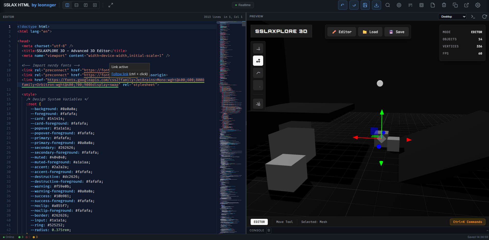
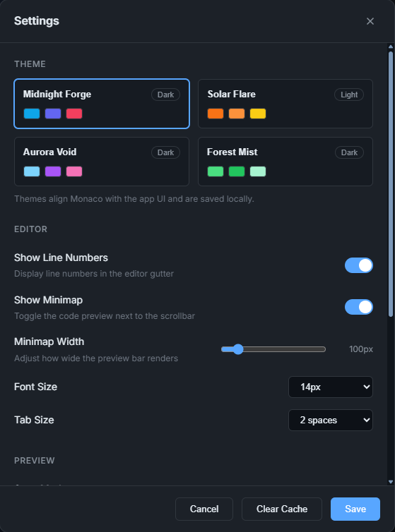
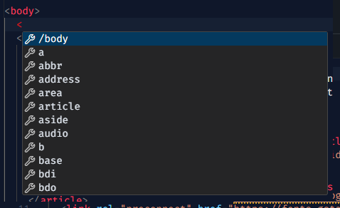
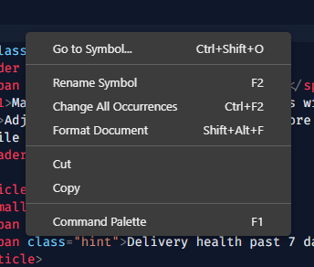
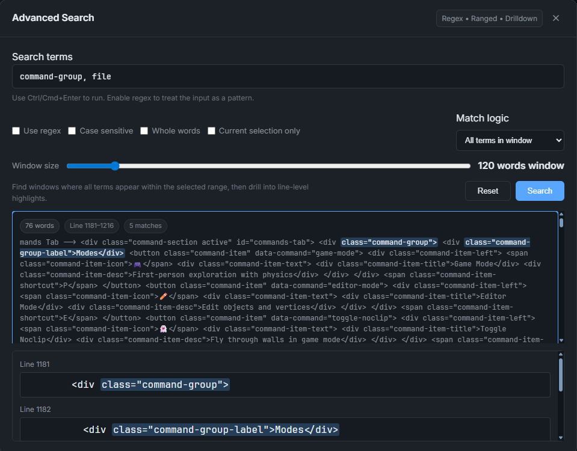
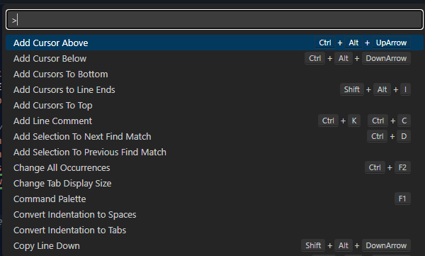
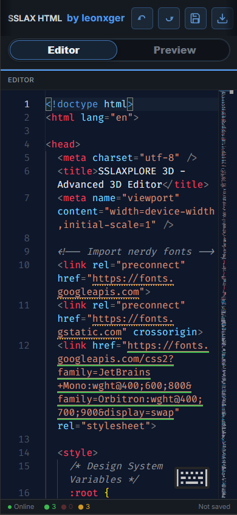

# SSLAX HTML — offline-first HTML viewer & editor

Fast, good-looking, open source HTML editor built to run entirely in your browser. Everything ships locally (≈11 MB), so after the first load your browser caches the static assets and you can keep working offline. No telemetry, no ads, nothing stored beyond your own local cache for settings and the current document.

## Why it exists
- Build and preview HTML instantly with Monaco-powered IntelliSense, formatting, context menus, and the F1 command palette.
- Stay local-first: all vendor files, templates, and fonts are bundled; only the optional link checker reaches the network.
- Save, restore, and clear everything from your browser cache—nothing ever leaves your machine unless you choose to download or copy it.

## Feature highlights
- **Editor ergonomics:** Monaco HTML language services, inline IntelliSense, format-on-command (Shift+Alt+F), context menu, command palette (F1), minimap toggle/width, line numbers, font size & tab size controls, keyboard hint overlay, drag-and-drop `.html` import, and undo/redo.
- **Layouts & preview:** Horizontal/vertical splits, editor-only/preview-only modes, draggable/snap divider with double-click reset, viewport presets (desktop/tablet/mobile), fullscreen toggle, mobile-friendly pane switcher, and an open-in-new-tab preview that renders your current code.
- **Sync control:** Realtime, paused-with-delay, or manual refresh (Ctrl+Enter) with a subtle refresh animation so you always know when the preview updated.
- **Search superpowers:** Inline find/replace with counts plus an advanced search modal (regex, case sensitivity, whole-word, selection-only, any/all term logic, adjustable window size, and line-level drill-down).
- **Templates & themes:** 9 starter templates (Blank HTML, Basic HTML5, Responsive Starter, Flex Workspace, Grid Layout, Launch Page, Form Suite, Product Dashboard, Portfolio Grid) and 4 curated UI/Monaco themes kept in sync with the app chrome.
- **Validation & console:** Optional external link checker (HEAD requests) with inline decorations and live counters; captured `console.log/ warn/ error` output from the preview iframe with badges and a collapsible drawer.
- **Export/backup:** Download HTML, copy to clipboard, open in a new tab, auto-save every 15s, manual save (Ctrl+S), clear editor vs. clear cache options, and quick template apply/reset.
- **Status & responsiveness:** Status bar for online/offline mode, validation counts, and last-saved timestamp; touch-friendly controls and a dedicated mobile editor/preview toggle.

## Screenshots
- Main workflow with live preview  
  
- Settings panel (themes, minimap, sync, validation, shortcuts)  
  
- IntelliSense in action  
  
- Right-click context menu in the editor  
  
- Advanced search (regex, windowed matches, drill-down)  
  
- Command palette (Monaco F1)  
  
- Template picker  
  
- Mobile layout preview  
  

## Run it locally (required)
1. Clone the repo and `cd` into it.
2. Serve the folder with any static server (examples):  
   - `python -m http.server 4173`  
   - VS Code Live Server / `npx serve` / any local HTTP file server  
3. Open `http://localhost:4173` (or your chosen port).

> Opening `index.html` directly via `file://` will block local fetches (templates/themes/Monaco) with “Not allowed to load local resource” / origin errors. Use a local server so the internal references resolve correctly.

## Usage guide
- **Start from a template:** Hit “Templates” or pick one from the empty state; templates load instantly from `data/templates.json` and stash in cache for next time.
- **Edit & preview:** Type or paste HTML; choose your sync mode (realtime, on-pause with adjustable delay, or manual refresh). Preview runs in a sandboxed iframe and mirrors scrollbar styling.
- **Search:** `Ctrl+F` toggles inline find/replace; `Ctrl+Shift+F` opens Advanced Search (regex, window size, any/all, selection-only).
- **Validate links (optional):** Toggle in Settings. When online, HEAD requests check external URLs and decorate them inline with counts in the status bar. Turn it off to stay fully offline.
- **Console:** Open the console drawer in Preview to see logs/errors from the iframe; badges highlight new messages.
- **Import/export:** Drag a local HTML file onto the editor, copy (toolbar), download, or open the current doc in a new tab. Autosave runs every 15s and on Ctrl+S; clear only the editor or nuke the cached copy via the clear modal.
- **Themes & polish:** Switch themes in Settings; Monaco and UI stay in sync. Minimap width, font size, tab size, and line numbers persist in localStorage.

## Keyboard shortcuts
- `Ctrl/Cmd + F` find • `Ctrl/Cmd + Shift + F` advanced search • `Ctrl/Cmd + H` replace field
- `Shift + Alt + F` format • `Ctrl/Cmd + S` save to local cache • `Ctrl/Cmd + Enter` refresh preview
- `Ctrl/Cmd + Z / Y` undo/redo • `Ctrl/Cmd + A` select all • `Esc` closes modals/search

## Offline, privacy, and caching
- All assets (Monaco, themes, templates, fonts) are local; bundle size is about 11 MB. After the first load, static files stay cached by the browser and generally won’t be re-fetched unless you hard-refresh.
- Your HTML, layout split, and settings live in localStorage only. Clearing the cache from Settings removes them.
- Works fully offline after first load; the only network call is the optional link checker (HEAD) and whatever external resources your HTML references.

## License & reuse
Totally open source—use it commercially, fork it, change it; credit is appreciated but not required. This is built for everyone.

## Cleanup note
After cloning, please delete this `README.md` and the `ui_screenshots/` folder. They exist solely to showcase the project on GitHub.

## About the build
This HTML editor was put together with the help of Claude Opus 4.5 (draft/prototype) and OpenAI GPT 5.1 Codex-Max (finishing, adding functionality, ...) to show what current LLMs can do. From idea to release (including testing) took about 5 hours and roughly $5—what a time to be alive. I think it's a pretty awesome lightweight, ad-free and open source HTML editor. Enjoy!

With Love, 
Leon ♡
